<h1 align="center">Hi 👋, I'm Fellipe Leonardo</h1>

I'm a software engineer focused on building reliable, maintainable, useful systems

I work across multiple levels of abstraction, from fine-grained resource management in Rust and C to applications and services built with Python and TypeScript

I value understanding how systems behave, choosing appropriate abstractions, and making thoughtful trade-off decisions

Go is currently my primary language for building practical software, particularly backend services and systems-oriented tools

<blockquote align="right">
  “I build to understand, and understand to build.”
   
  ― A reinterpretation of Richard Feynman's quote
</blockquote>

<h2></h2>

<section>
  

     
    
      
    
      
    
  

</section>

 

  

